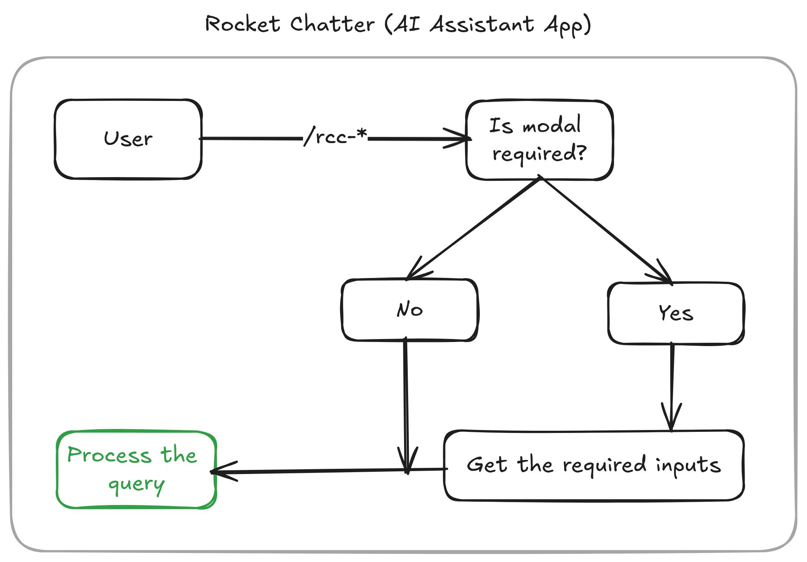
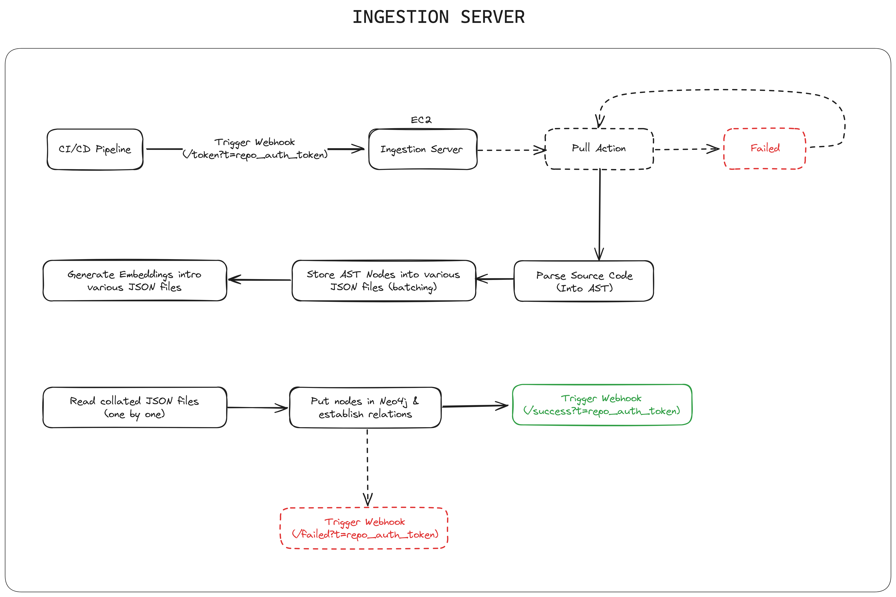

# Rocket Chatter App

Rocket Chatter App is an open-source AI-powered assistant designed to help developers understand and navigate the complex codebase of Rocket.Chat, a leading open-source team communication platform. By leveraging advanced techniques like Language Models (LMs), Retrieval Augmented Generation (RAG) pipelines, and a graph database, the app provides accurate and contextual information to developers, streamlining the development process and enhancing collaboration within the Rocket.Chat community.

## Features

### Codebase Comprehension Assistance

- **Ask Questions**: Developers can ask specific code-related questions, and the app will provide detailed explanations by automatically setting the context and tracing back to related entities and dependencies. For example, a developer can ask, "What does the `allocUnsafe` method do and how does it achieve its goals?" and the app will provide a comprehensive explanation, including its dependencies and interactions with other parts of the codebase.

- **Generate Diagrams**: The app can generate visual representations of the codebase's structure and relationships, aiding developers in understanding the architecture and dependencies. Developers can request diagrams for specific entities or the entire codebase, and the app will generate diagrams using popular formats like Mermaid or PlantUML.

- **Extract Documentation**: Developers can request documentation for specific entities within the codebase, and the app will generate comprehensive documentation in various formats, including JSDoc for TypeScript and JavaScript codebases, and plain English for non-technical stakeholders. The documentation will include descriptions, usage examples, and relevant code snippets.

### Code Enhancement and Best Practices

- **Find Similar Code**: The app can search the codebase for similar code snippets, helping developers learn from existing implementations, identify patterns, and avoid duplication. Developers can provide a code snippet, and the app will find similar code across the project, facilitating code reuse and consistency.

- **Assess Code Importance**: The app can evaluate the criticality and centrality of code entities, providing insights into their impact and dependencies, which is crucial for tasks like refactoring or introducing new features. The app will generate scores for criticality (how many other parts of the code depend on this entity), centrality (how connected this entity is to other parts), and overall importance, helping developers prioritize their efforts.

- **Suggest Improvements**: The app can analyze code snippets and offer targeted refactoring suggestions, such as renaming variables, extracting code into reusable functions, removing dead code, and optimizing performance. These suggestions will help developers write cleaner, more efficient, and maintainable code while adhering to the project's coding standards.

### Accessibility and Collaboration

- **Translate Code**: The app supports code translation between different programming languages, facilitating collaboration and knowledge sharing across diverse development environments. Developers can provide code snippets in one language, and the app will translate them to another language while preserving the context and functionality.

- **Explain Code Usage**: The app can provide clear reasoning and explanations about why specific code entities are used, their importance, and the potential consequences of modifying or removing them. This feature helps developers make informed decisions during development, maintenance, and refactoring tasks.

- **Integrate Documentation**: The app can integrate external documentation, tutorials, or resources directly into the development environment, providing developers with contextually relevant information within the codebase. This feature reduces context switching and improves productivity by keeping developers focused on the code while having access to relevant documentation.

## Getting Started

### Prerequisites

- Node.js (version 14.x or higher)
- npm (version 6.x or higher)
- Neo4j (version 5.x or higher)

### Installation

1. Clone the repository: `git clone https://github.com/RocketChat/Apps.AI.Codebase.Assistant`
2. Navigate to the project directory: `cd rocket-chatter-app`
3. Install dependencies: `npm install` or `bun install`
4. Set up the required environment variables (e.g., database credentials, API keys) by creating a `.env` file based on the provided `.env.example` file.
5. Build the project: `npm run build`
6. Start the application: `npm start`

### Usage

Once the application is running, you can access the Rocket Chatter App through the Rocket.Chat interface. The app provides various slash commands (e.g., `/rcc-askcode`, `/rcc-diagram`, `/rcc-document`) that you can use to interact with the assistant.

## Architecture

The Rocket Chatter App follows a modular architecture with the following main components:

1. **Rocket Chat Application**: A user-friendly interface for developers to interact with the system, enabling them to ask questions, request diagrams, and access documentation directly within the Rocket.Chat environment. The application is built using the Rocket.Chat App Engine SDK and is deployed as a Rocket.Chat App. 
2. **Ingestion Server**: Responsible for parsing the Rocket.Chat codebase, extracting relevant information, and storing it in the Neo4j graph database. It utilizes compiler APIs like `ts-morph` and `jscodeshift` to handle TypeScript and JavaScript code constructs. The ingestion process involves chunking the codebase, generating embeddings for code entities, and establishing relationships between them in the graph database. 

### Development Environment Setup

1. Fork the repository and clone your fork: `git clone https://github.com/your-username/Apps.AI.Codebase.Assistant.git`
2. Navigate to the project directory: `cd Apps.AI.Codebase.Assistant`
3. Install dependencies: `bun install`
4. Set up the required environment variables (e.g., database credentials, API keys) by creating a `.env` file based on the provided `.env.example` file.
5. Start the development server: `npm run dev`
